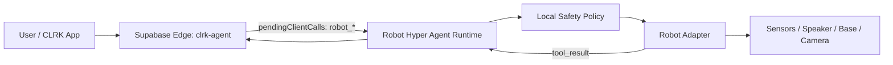

# CLRK Robot Hyper Agent Runtime

This is the first installable robot-side framework for CLRK. It turns a robot computer into an embodied CLRK client that can:

- Connect to the CLRK `clrk-agent` cloud runtime.
- Advertise robot capabilities as structured client tools.
- Execute safe local tools such as status, speech, sensor reads, camera capture, stop, mode changes, and guarded base movement.
- Enforce a local safety policy before physical actuation.
- Resume the CLRK agent loop with tool results.

The cloud agent remains the reasoning layer. The robot runtime is the embodied execution layer.

## Architecture



## Install On A Robot

From the repository root:

```bash
cd robot-runtime
npm install
npm run build
cp .env.example .env
```

Fill `.env` with:

- `CLRK_SUPABASE_URL`: your Supabase project URL.
- `CLRK_ACCESS_TOKEN`: a signed-in user session JWT from the CLRK app.
- `CLRK_ROBOT_ID`: a stable hardware id.
- `CLRK_AUTONOMY_LEVEL`: default safety posture (`L0_advisory` through `L5_ambient`).

Run:

```bash
npm start
```

## Hardware Adapters

The included `MockRobotAdapter` is safe for development. To install on real hardware, implement `RobotAdapter`:

```ts
import type { RobotAdapter } from "@clrk/robot-runtime";

export class MyRobotAdapter implements RobotAdapter {
  // implement status(), say(), readSensors(), captureImage(), moveBase(), stop(), setMode()
}
```

Keep the adapter thin. Hardware-specific SDK calls belong there. The kernel owns CLRK protocol, safety, and tool dispatch.

## Safety Model

The runtime treats physical actions differently from digital actions:

- `robot_status`, `robot_read_sensors`, `robot_capture_image`, `robot_say`, and `robot_set_mode` are low or medium risk.
- `robot_move_base` is physical-world actuation and requires recent sensor context.
- `robot_stop` is always allowed.
- Motion approval can be required even at higher autonomy levels with `CLRK_REQUIRE_MOTION_APPROVAL=true`.

This is a trust kernel, not a toy loop. The robot must be able to say “no” locally when cloud instructions are unsafe.

## Next Adapter Targets

- ROS 2 adapter for TurtleBot, Unitree, custom mobile bases.
- Raspberry Pi GPIO adapter for simple relay/servo robots.
- WebRTC camera adapter.
- Local wake-word and microphone stream.
- Docking and charging adapter.
